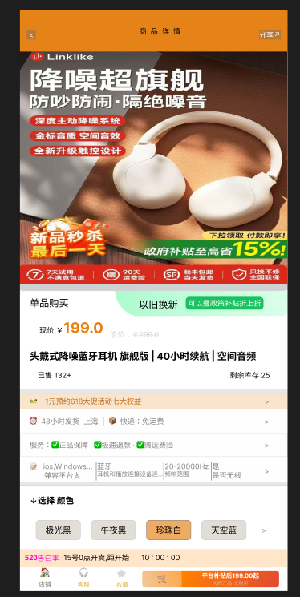

# 产品需求文档 (PRD)：商品详情页

## 1. 功能背景与目标
* **背景**：商品详情页是电商 MVP 系统中承接流量、促成购买决策的关键节点。
* **目标**：为用户提供详尽的商品信息展示，支撑用户完成规格选择，并作为核心入口引导用户进入“加入购物车”或“立即购买”流程。

---
## 2. 交互原型预览 (Interface Prototype)

本项目基于组件化思维完成了高保真界面设计，确保交互逻辑对齐开发标准。

#### 🎨 核心交互细节标注：
1. **价格对齐逻辑**：采用 Auto Layout 处理，确保“现价”与“原价”在不同长度下始终保持**底部基线对齐**，符合电商视觉规范。
2. **SKU 选中态反馈**：
   - **选中状态**：背景填充为淡橙色（#EDAB64），提供明确的视觉反馈。
   - **未选中状态**：背景为浅灰色（#E1DDD7），维持低视觉权重。
3. **响应式布局**：整个“基础信息区”与“操作栏”均支持 Fill Container，适配不同尺寸的移动终端。

## 3. 页面字段说明 (Page Fields)

### 3.1 基础信息区 (SPU 维度)
* **商品标题**：展示商品的核心名称。
* **主图轮播**：支持多张高清大图展示，首张默认展示 SPU 封面图。
* **累计销量**：展示该商品在全平台的历史成交量。
* **商品详情图文**：展示商品的功能介绍、使用说明等富文本内容。

### 3.2 规格交易区 (SKU 维度)
* **规格选择器**：展示当前商品的所有可选规格（如颜色、尺码、套餐）。
* **动态售价**：根据用户选中的规格实时切换显示。
* **划线价**：展示商品的原价，用于对比促销力度。
* **可用库存**：实时显示当前选中规格的剩余数量。

---

## 4. 核心业务规则 (Business Rules)

1.  **数据默认加载**：
    * 用户进入页面时，若未指定 SKU，系统默认选中首个有货的 SKU。
    * 价格展示区显示该 SKU 的当前售价。
2.  **SKU 联动交互**：
    * 用户切换规格（如从“白色”切换为“黑色”）时，系统必须即时刷新“现价”与“库存”字段。
    * 若某规格库存为 0，该选项应置灰，提示“暂时无货”。
3.  **商品状态管控**：
    * **下架拦截**：若后端返回商品状态为 `OFF_SALE`，页面底部操作栏（加入购物车、立即购买）必须全局置灰，文案显示为“商品已下架”。
    * **售罄逻辑**：若当前 SPU 下所有规格库存均为 0，操作栏显示“已售罄”。

---

## 5. 异常处理与提示 (Exception Handling)

* **库存脏读处理**：用户在页面停留时库存被他人买空。用户点击购买时，系统调用 `canSubmitOrder` 接口进行二次校验，若失败，前端弹出 Toast 提示：“商品已被抢光，请看看别的”。
* **网络连接超时**：若核心商品信息接口请求失败，展示缺省页，并提供“点击重试”按钮。

---

## 6. 验收标准 (Acceptance Criteria)

1.  **交互准确性**：切换不同规格时，价格、图片、库存数据必须 100% 匹配，不得出现错位。
2.  **功能完备性**：下架商品绝对无法点击进入结算流程。
3.  **渲染性能**：在常规网络环境下，页面核心文字与价格信息的渲染时间应控制在 1 秒以内。

---
> ** PM 研发协同笔记 (PM's Technical Insight)**
> 在定义 SKU 联动逻辑时，我建议研发端在 API 设计上采用“增量刷新”或“全量 SKU 矩阵本地缓存”的方案。由于 MVP 版本商品规格较少，可以将该商品下所有 SKU 的价格、库存信息随 SPU 接口一次性下发，减少用户切换规格时的网络请求等待，提升操作丝滑度。
