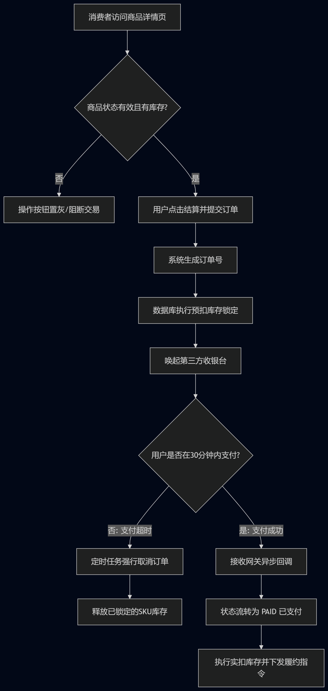

# 电商平台 MVP 核心交易链路设计与系统化落地

> **执行摘要**
> 本项目采用基于电商平台的MVP架构设计。项目从0到1梳理了电商业务的核心交易闭环，涵盖了需求端与供给端的用户角色定义、功能优先级划分、核心业务流程与状态机流转，以及标准化产品需求文档的系统化输出。

## 项目背景与目标

本项目旨在规划并设计一个基础电商系统的核心交易链路。在严格的资源与时间约束下，系统需优先保障“商品展示 → 加入购物车 → 订单结算 → 资金支付 → 履约发货”这一主干业务流的物理畅通，并为后续的数据驱动迭代与体验优化奠定底层逻辑框架。

* **项目角色**: 产品经理
* **核心焦点**: 交易闭环设计、状态机建模、前后端异常边界处理、业务指标度量。

## 核心资产导航

本项目的所有产出物均遵循标准化技术工程文档规范，按逻辑模块划分如下：

* **01. 产品架构**：包含用户角色与核心场景定义、MVP 功能列表与优先级划分。
* **02. 业务流转**：包含消费者下单支付、后台履约发货的核心流程设计，以及订单状态机模型。
* **03. 需求说明**：包含商品详情页的标准 PRD，涉及 SPU/SKU 联动计算规则与库存拦截防线。
* **04. 技术边界**：包含 API 数据模型业务映射、伪代码逻辑校验、Bug 异常排查及核心数据监控指标设计。

## 核心技术与业务难点攻克

1. **复杂数据结构的业务映射**：准确拆解并设计 SPU (标准化产品单元) 与 SKU (库存量单位) 的从属关系。
2. **高并发场景下的异常防御**：针对“缓存延迟”与“抢单超卖”等并发场景，确立了以“后端强校验作为唯一事实来源”的产品安全防线。
3. **严谨的订单状态机流转**：定义了待支付、已支付、已发货等法定状态节点，并规范了状态跃迁的触发条件与逆向售后准入逻辑。

## 🖼️ 项目核心视觉资产 (Project Visual Assets)

为了直观展示业务逻辑与交互细节，本项目产出了完整的流程建模与交互原型：

### 业务逻辑流程图 (Flowchart)
梳理了从进入详情页到支付完成的全链路逻辑分支，包括库存校验与异常处理状态。

###  Figma 高保真交互原型 (Interactive Prototype)
基于 Figma Auto Layout 构建的响应式购物界面，包含 SPU/SKU 联动逻辑与核心转化路径。
* https://www.figma.com/design/ilLIWjGUOM96OAbmXwOhrm/Untitled?node-id=0-1&m=dev&t=vqVbu8fch0PBxQMQ-1 **[点击此处访问 Figma 实时预览链接]**

> **设计亮点说明：**
> - **组件化设计**：采用原子设计规范，所有 UI 元素均可复用，对齐前端开发标准。
> - **逻辑对齐**：原型图中的价格精度、SKU 状态与 PRD 文档中的 API 定义完全一致。

## 数据指标监控体系

为验证 MVP 上线后的商业价值，构建了基于漏斗模型的五维核心数据监控矩阵：
* **流量漏斗**: 商品详情页浏览量 (PV/UV)
* **意向漏斗**: 加购率
* **转化漏斗**: 订单转化率与支付成功率
* **北极星指标**: 交易总额 (GMV)
